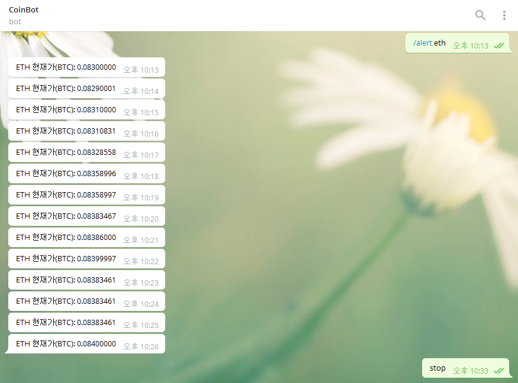

# Telegram Coin Bot
The telegram bot shows the coin price every minute.

## Installation
```sh
$ sudo npm install -g
```

## Excute
```sh
$ npm run bot
```

## File Detail
| Filename | Description |
| ------ | ------ |
| package.json | Repository Detail |
| bot.js | Telegram Bot Execute File |
| poloniex/coin.js | Telegram Bot Setting & Coin Parse |

### Setup

`poloniex/coin.js` Telegram Bot API KEY

```sh
this.bot = new telegrambot("YOUR TELEGRAM BOT API KEY", {polling: true}); // Telegram Bot key setting	
this.alertTimeOut = 60 * 1000; // Alert delay time setting
this.user_agent = "Mozilla/5.0 (Windows NT 10.0; Win64; x64) AppleWebKit/537.36 (KHTML, like Gecko) Chrome/58.0.3029.110 Safari/537.36"; // User-Agent setting
```

### Use
```/alert (coinname)``` Alert enable every minutes

```stop``` Alert disable

### Demo



### License
MIT

